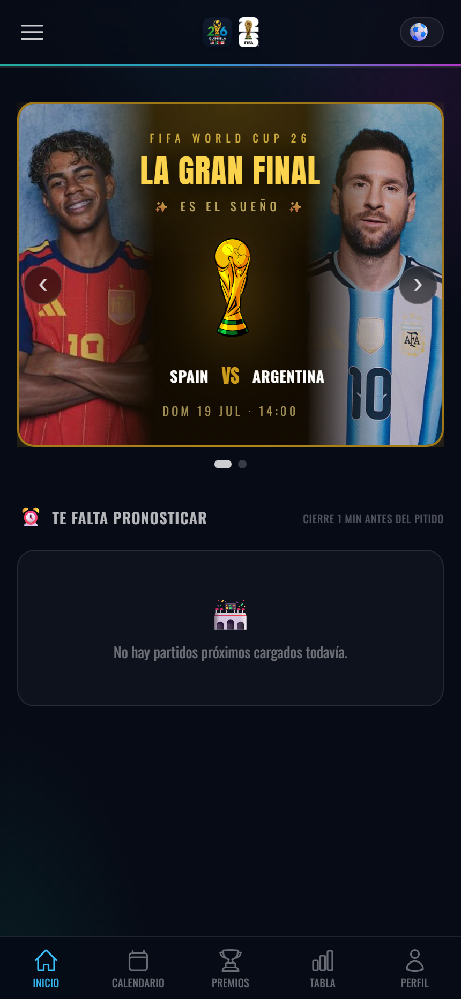
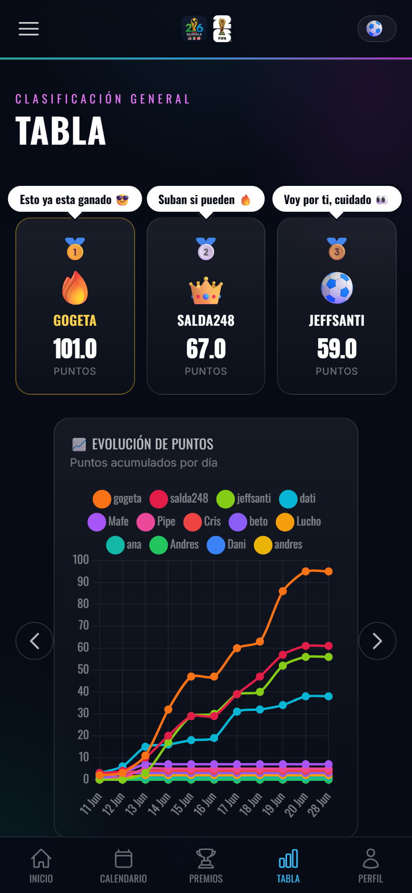

# ⚽ Polla Futbolera — Mundial 2026

Quiniela (polla) del Mundial FIFA 2026 para jugar entre amigos: cada participante pronostica marcadores, goleadores y premios del torneo, y una tabla de posiciones en vivo decide quién manda. Los resultados reales se sincronizan solos desde las APIs públicas — nadie tiene que cargar marcadores a mano.

> **Estado**: proyecto terminado. Corrió en producción en **Render** durante todo el Mundial 2026 (junio–julio) con un grupo real de jugadores, sincronizándose partido a partido; al terminar el torneo se dio de baja el hosting. Se puede levantar en local en dos comandos (ver abajo).

## Capturas

| Inicio — La Gran Final | Tabla de posiciones |
|---|---|
|  |  |

El podio muestra las "viñetas" que cada líder puede dejarle al resto, y la gráfica de evolución cuenta la historia del torneo día a día.

## Qué se puede hacer

- **Pronosticar cada partido**: marcador exacto, goleadores en orden (el 1er gol de Colombia, el 2do…), autogoles, y en eliminatorias quién avanza y el marcador de penales.
- **Tabla en vivo**: los puntos provisionales se calculan mientras el partido se juega, con desglose de dónde sale cada punto.
- **Comodines**: uno gratis por fase (x2) y una tienda donde se compran multiplicadores (x2 / x3) gastando puntos de la propia tabla — comprar te baja en la clasificación: es el riesgo.
- **Bonos especiales**: "solo tú lo clavaste" (+3 si eres el único que acierta un marcador o quién avanza), autogol en tres niveles (20/5/2 pts), total de goles del Mundial, premios (Bota/Balón/Guante de Oro, campeón, subcampeón, finalistas).
- **El cuadro eliminatorio** con el árbol oficial FIFA 2026 y auto-avance de ganadores; en la Final se convierte en una portada especial con los protagonistas.
- **Panel de admin**: crear usuarios, resetear claves, forzar resultados, recalcular puntajes retroactivamente cuando cambian las reglas, y publicar letreros en el inicio.
- **Bromas internas** 🤡: el "vendepatria" (payaso animado para quien apuesta contra su propia selección), modo Colombia (la página se viste de amarillo el día que juega la Tricolor, con canción incluida), llamadas falsas con videos meme antes de partidos clave, e himnos que suenan según a quién pongas ganando.
- **3 idiomas** (español, portugués, inglés) e instalable como **PWA** en el celular.

## Stack

| Capa | Tecnología |
|---|---|
| Backend | **Python + FastAPI**, plantillas Jinja2 (SSR) |
| Frontend | HTML + **Tailwind CSS** + JavaScript vanilla (sin frameworks) |
| Base de datos | SQLite en desarrollo · **Turso** (libSQL en la nube) en producción, vía su API HTTP con una capa de compatibilidad propia |
| Datos en vivo | [football-data.org](https://www.football-data.org/) (fixture y marcadores) + API pública de **ESPN** (goleadores y autogoles), sincronizados por un scheduler (APScheduler) cada 5 min |
| Hosting | **Fly.io** |

## Correr en local

```bash
pip install -r requirements.txt
uvicorn app.main:app --reload
```

Abre `http://localhost:8000`. Sin configurar nada usa un SQLite local (`polla.db`).

Variables de entorno (opcionales en local, necesarias en producción):

| Variable | Para qué |
|---|---|
| `FOOTBALL_API_KEY` | Token de football-data.org (plan gratuito alcanza) |
| `TURSO_URL` / `TURSO_TOKEN` | Base de datos de producción |
| `SECRET_KEY` | Firma de las sesiones |

## Estructura

```
app/
├── main.py            # FastAPI + scheduler de sincronización
├── database.py        # SQLite local / capa HTTP de Turso + migraciones
├── scoring.py         # Todas las reglas de puntaje en un solo lugar
├── football_api.py    # Sync de fixture y marcadores (football-data.org)
├── espn.py            # Sync de goleadores y autogoles (ESPN)
├── i18n.py            # Diccionario ES / PT / EN
├── routes/            # Vistas: partidos, predicciones, ranking, admin, tienda…
├── templates/         # Jinja2 + Tailwind
└── static/            # Escudos, audios, imágenes, service worker (PWA)
```

## Detalles de diseño de los que estoy orgulloso

- **Regla anti-exploit de goleadores**: tienes exactamente tantos "slots" de goleador como goles predices — predecir 99-98 te obliga a acertar 197 goles en orden, así que nadie infla marcadores.
- **Anti-copia**: los pronósticos ajenos se ocultan hasta que el partido cierra (1 min antes del pitido).
- **Puntaje recalculable**: cualquier cambio de reglas se aplica retroactivamente con un botón del admin — las reglas viven en `scoring.py`, los datos crudos nunca se pierden.
- **Fuentes cruzadas**: football-data.org mete los penales dentro del marcador (`fullTime` 4-5 en un 1-1) y ESPN marca los partidos con prórroga con estados distintos; el sync reconcilia ambas fuentes para que la tabla nunca mienta.
